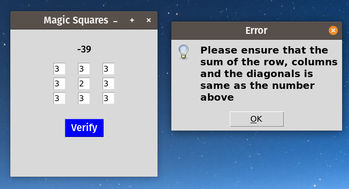
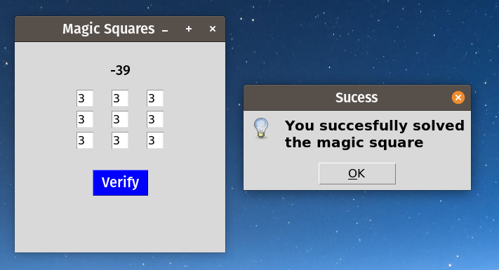

# Magic-Squares
A game of magic squares made in python's tkinter
# How to play it :- 

On the text boxes you have to enter a number so that adding it from each rows, column and diagonals is the same.

# System Requirements:-

Any computer having Python 3.5 and above with tkinter.

To install tkinter :- `pip install tk`

# GUI:-

> Error

> Sucess

**Note:-** On the screenshots above the inputs were -13 and -12 and using the - before the last digit the - and the number after the - sign may not appear
